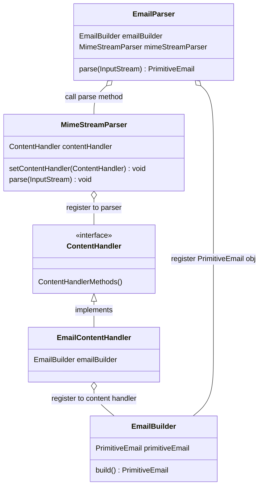

# Email Bootstrap Service
Bootstrap service is responsible for ingesting the historical data
into database. This will run only once(if nothing goes wrong in the run) for a
provided data source.

This will have a reader mechanism that can read the data from 
different sources and an email parsing mechanism that can parse a 
raw email and create a POJO from it to ingest into kafka.

The bootstrap data will be labelled(spam / ham) data. In some case it may not be
labelled we need to take care of that.

Apart from this we need to have a streaming ingestion service that will
cater to the incoming emails of the clients. This will be the main data
that we need to classify. This data will not be labelled(spam / ham), 
we need to correctly label it.

### Backend responsibilities.
#### Base requirements:
- Read files from different sources such as
  - files(from folders of a given machine)
- Transfer it into kafka in a standardised form.
- Try to preserve some metadata in the kafka message. Such as file name, message size in bytes.
- Save a local copy of the files in hdfs / s3. This will create a backup copy.

#### Optional requirements:
- Read files from different sources such as
  - hdfs
  - s3
  - http / https
  - email servers
  - databases (need some triage)
- Make the readers multithreaded.
- Log standardized reports to process later.
- Log system metrics and health-checks to manage load.

### User interface.
#### Base requirements:
- User should be able to provide links for the data sources.
- The links need to be verified as working and not harmful.
- Display:
  - Total number of records found and data size.
  - Total number of passed(ingested) records.
  - Total number of failed(not ingested) records.
  - Total data size of ingested and not ingested data.
- User should get some acknowledgement that the processing has finished.

#### Optional requirements:

- User should see the live time required to process.
- User should be able to re-run the pipeline in case of failure.
- User should get a proper reason of failure and list of failed records.

#### Future to-dos:

- [ ] Make the read process from a datasource multithreaded. This will help to
  read all the emails from a source much faster.
- [ ] Currently, the email parser is quite ambiguous.
- [ ] Add file name in metadata. Currently, only source URI is there.
- [ ] Add proper logging for
  - [ ] Primitive email parser.
  - [ ] Primitive to civilised email converter.
  - [ ] Data source factory.
  - [ ] File data source reader.
  - [ ] File data source inputstream.
      Currently the failed emails are not getting identified.
- [ ] Quarantine the emails that failed to parse.
- [ ] Adjust the error handling such that parsing error do not terminate the whole application.
- [ ] Produce reports of parse data.
- [ ] Provide an endpoint to fetch these reports.
- [ ] Try to find an alternative to random UUID allocation as id for emails. As I have found that some
  emails are duplicates. Try to find some hashing methods that could assign an id.

The process is like:
1. First we have to create a CustomContentHandler (in our case it is EmailContentHandler) that implements ContentHandler interface.
2. This EmailContentHandler needs to be registered with MimeStreamParser instance using setContentHandler() method.
3. After registering this we can use our EmailContentHandler when we parse the inputstream email object.
4. In our EmailContentHandler we need to implement the methods of ContentHandler interface. 
5. We also need to register an instance of EmailBuilder instance to build a tree like object of PrimitiveEmail as node.
6. EmailBuilder does not create a PrimitiveEmail object. We need to register a new instance of PrimitiveEmail object in EmailBuilder
so that it can fill in the data inside the object.
7. So we have a EmailParser class that has parse(inputStream) method that will set the PrimitiveEmail in the EmailBuilder
and call the parse(inputStream) method of MimeStreamParser.
8. Inorder to make parsing thread safe we have locked the PrimitiveEmail object that we register in EmailBuilder until the
parsing is over.
